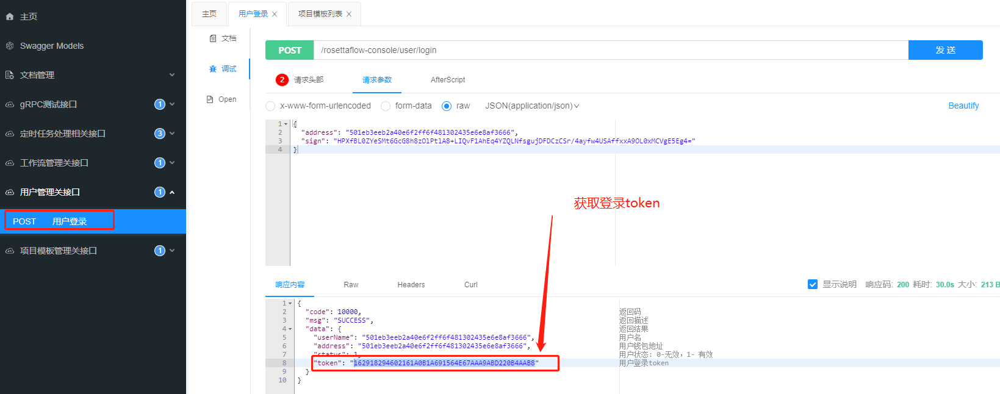
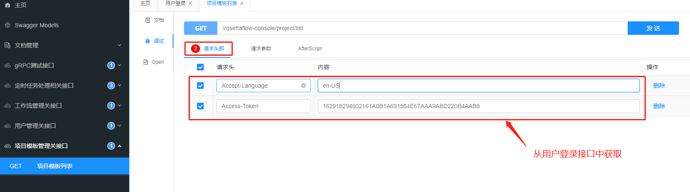
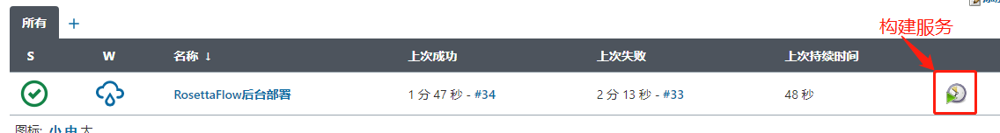
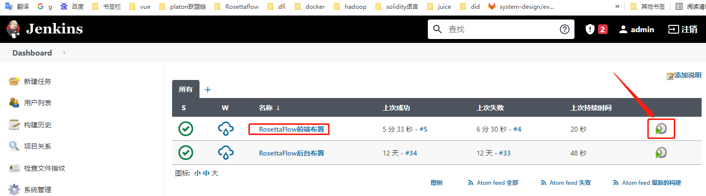
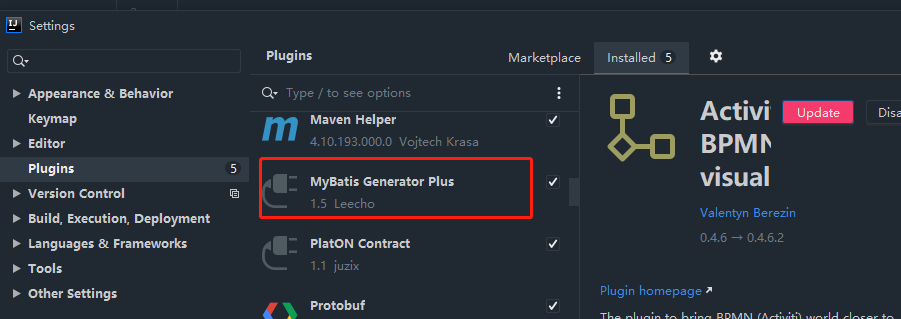
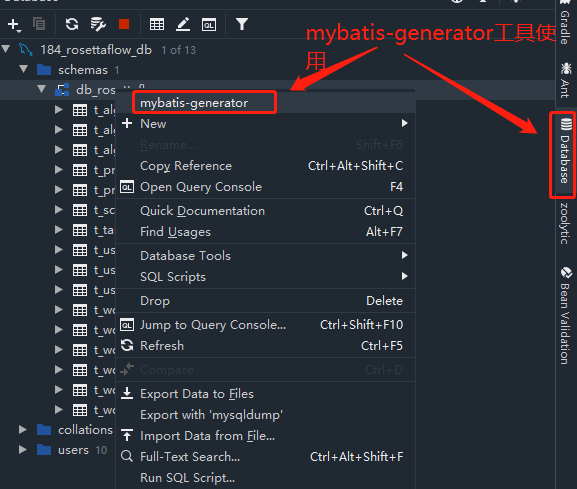
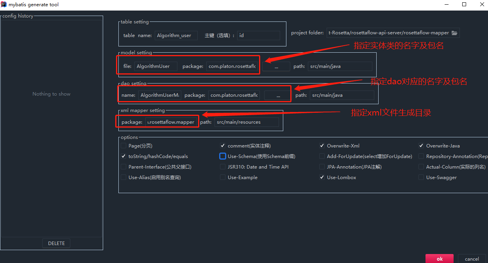

## RosettaFlow-api-server 管理后台

### 1.后台服务api接口文档，采用swagger
- 访问地址：http://10.10.8.182:8234/rosettaflow/doc.html

#### swagger调试流程
- 先获取token

- 请求后台携带token


### 2.Jenkins自动部署
#### 管理后台
> 为了不影响前端开发，目前设置手动构建
- 访问地址：http://10.10.8.182:8080/login?from=%2F
- 用户名：admin
- 密码：admin
- 将代码提交develop分支，点击构建，如下图所示：


#### 前端
前端访问地址：http://10.10.8.182/home


### 3.mysql数据库反向生成java类
- idea需要先安装mybatis-generator插件：File->settings->plugins


- idea配置数据库连接



- 数据库表生成java实体对类


RosettaFlow model对应包名
```
com.platon.rosettaflow.mapper.domain
```

RosettaFlow dao对应包名
```
com.platon.rosettaflow.mapper
```

RosettaFlow xml文件对应包名
```
com.platon.rosettaflow.mapper
```

model是常用注解说明
```
【@TableName 】
    @TableName               用于定义表名
注：
    常用属性：
        value                用于定义表名
示例：@TableName(value = "t_user")

【@TableId】
    @TableId                 用于定义表的主键
注：
    常用属性：
        value           用于定义主键字段名
        type            用于定义主键类型（主键策略 IdType）

   主键策略：
      IdType.AUTO          主键自增，系统分配，不需要手动输入
      IdType.NONE          未设置主键
      IdType.INPUT         需要自己输入 主键值。
      IdType.ASSIGN_ID     系统分配 ID，用于数值型数据（Long，对应 mysql 中 BIGINT 类型）。
      IdType.ASSIGN_UUID   系统分配 UUID，用于字符串型数据（String，对应 mysql 中 varchar(32) 类型）。
示例：@TableId(type = IdType.AUTO)

【@TableField】  
    @TableField            用于定义表的非主键字段。
注：
    常用属性：
        value                用于定义非主键字段名
        exist                用于指明是否为数据表的字段， true 表示是，false 为不是。
        fill                 用于指定字段填充策略（FieldFill）。
        
    字段填充策略：（一般用于填充 创建时间、修改时间等字段）
        FieldFill.DEFAULT         默认不填充
        FieldFill.INSERT          插入时填充
        FieldFill.UPDATE          更新时填充
        FieldFill.INSERT_UPDATE   插入、更新时填充。
示例：@TableField(value = "`status`")

【@TableLogic】
    @TableLogic           用于定义表的字段进行逻辑删除（非物理删除）
注：
    常用属性：
        value            用于定义未删除时字段的值
        delval           用于定义删除时字段的值
        
【@Version】
    @Version             用于字段实现乐观锁
```

